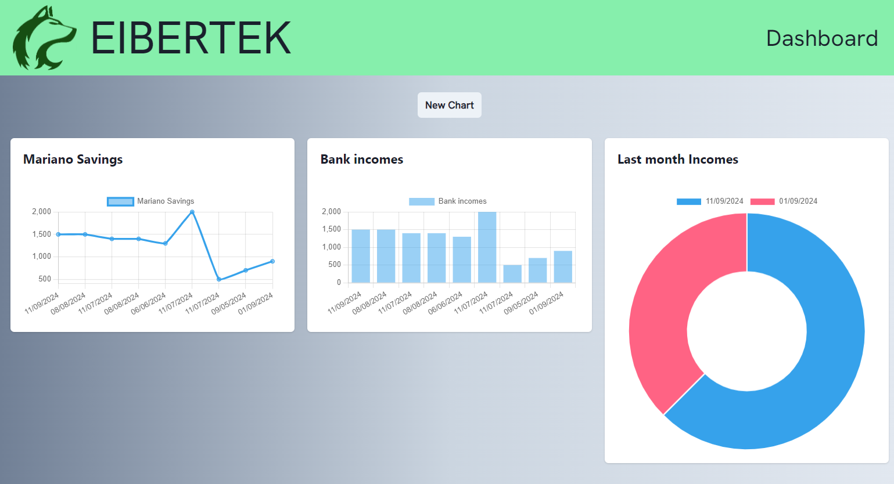
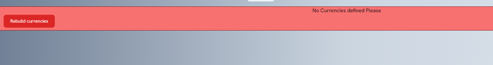
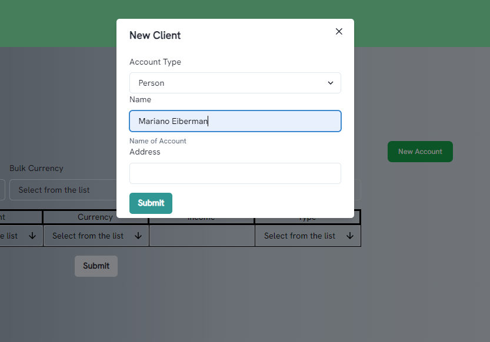
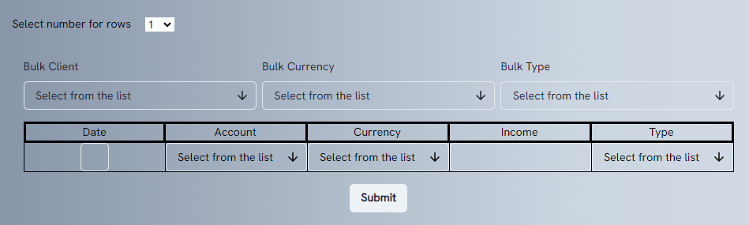
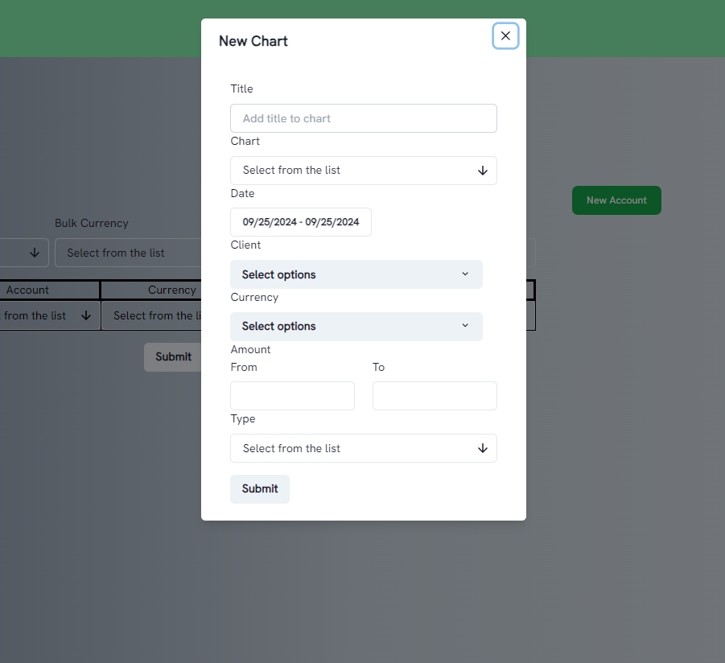

 
[](https://github.com/eibertek/etk-money)

[](https://github.com/eibertek/etk-money)
[](https://github.com/eibertek/etk-money)
[](https://github.com/eibertek/etk-money)

# Etek Money management

## this is a Next.js Application where you can track money from several accounts and have dashboard with your totals, incomes and outcomes

---
You can use a demo version here: https://etk-money.vercel.app/
```
username: root 
password: zxcv1234
```
Demo Image:



----

### For the first time
First time you login, you will notice an error about currencies, with the build button you may be able to add the currencies u$s, Ars and JPN.


After that you will need Accounts (to save mvoes, each one use an account).


You can use the shortcut to add moves and see how is work:


Tip: in this version you may need to add or change currencies (as exchange rate)
you can do that on this url: https://etk-money.vercel.app/money/currencies/manage
or create a completely new one: https://etk-money.vercel.app/money/currencies/new

To use charts, you will need to create new ones with the New Chart button


